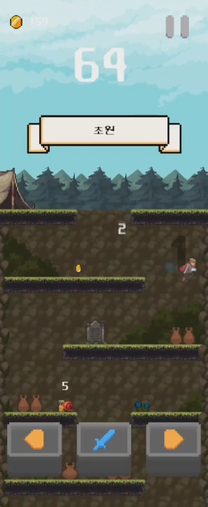
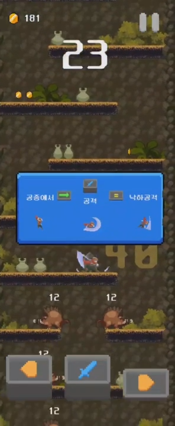

# Minute Dive

## 프로젝트 개요
제한 시간 내에 최대한 던전을 깊이 탐사하는 것이 목적인 게임입니다. 길을 막거나 나를 위협하는 몬스터들을 처치하며 1분이라는 시간 내에 최대한 깊이 도달하세요. 던전 내에서 획득한 아이템을 장착하고 입장하여 강화된 상태로 플레이할 수 있습니다.

    
    
    
    

## 주요 기능

### 게임 기능
- 장비를 장착하여 플레이어의 스탯을 강화할 수 있습니다.
- (게임 기능 2)

### 기술적 특징
- Unity Engine을 사용한 모바일 게임 개발
- C# 스크립트를 통한 게임 로직 구현
- (기술적 특징 3)

---
## 조작법

| 조작키 또는 액션              | 설명                   |
|------------------------------|-----------------------|
| 공격 | 바라보는 방향으로 공격합니다. 공격 버튼을 연타하여 계속하여 공격을 시도할 수 있습니다. 공중에서 공격 시, 낙하 공격을 사용합니다. 낙하 공격은 착지 시 착지 지점 주변에 피해를 줍니다. |
| 이동 | 캐릭터가 좌/우 방향으로 이동합니다. 공격 직후 사용 시 대시가 나갑니다.|

---

## 설치 및 실행 방법

APK 파일 다운로드를 통해 직접 설치 및 플레이가 가능합니다.
1. 제공된 [Google Drive 링크](링크주소입력)에서 APK 파일 다운로드
2. 안드로이드 기기에서 `설정 > 보안 > 출처를 알 수 없는 앱 설치 허용` 활성화
3. 다운로드한 APK 파일을 실행하여 설치

---

